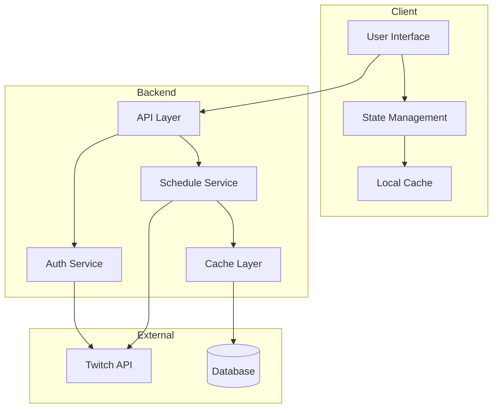
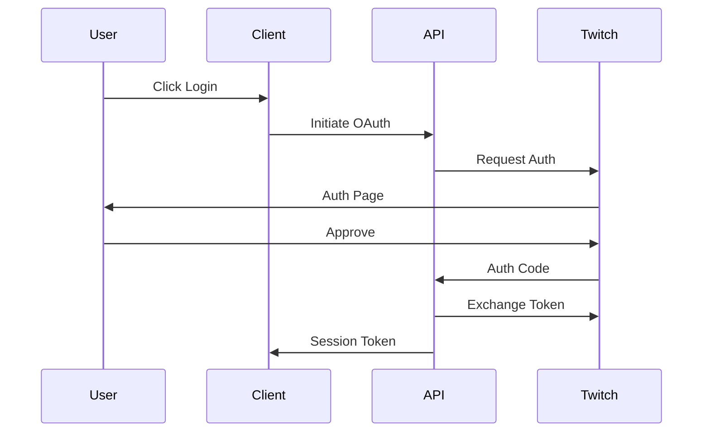

# System Patterns

## System Architecture



## Key Design Patterns

### 1. Authentication Flow


### 2. Data Access Patterns

#### Repository Pattern
- Abstraction layer between business logic and data access
- Consistent interface for data operations
- Simplified testing and maintenance

```typescript
interface ScheduleRepository {
    getStreamerSchedule(streamerId: string): Promise<Schedule>;
    updateSchedule(streamerId: string, schedule: Schedule): Promise<void>;
    getFollowedSchedules(userId: string): Promise<Schedule[]>;
}
```

#### Caching Strategy
- Two-level caching system
  1. Client-side cache for UI data
  2. Server-side cache for API responses
- Cache invalidation based on:
  - Time-based expiry
  - Manual updates
  - Webhook triggers

### 3. Component Architecture

#### Frontend Patterns
- Container/Presenter pattern
- Custom hooks for business logic
- Shared state management
- Modular CSS with component scope

```typescript
// Example component structure
/components
  /common          // Reusable UI components
  /features        // Feature-specific components
  /layouts         // Page layouts
  /hooks          // Custom React hooks
  /containers     // Data containers
```

#### Backend Patterns
- Service-based architecture
- Middleware chain pattern
- Error boundary system
- Rate limiting implementation

```typescript
// Service pattern example
class ScheduleService {
    private repository: ScheduleRepository;
    private cache: CacheService;
    
    async getSchedules(userId: string): Promise<Schedule[]> {
        // Implementation with caching and error handling
    }
}
```

### 4. Error Handling Pattern
- Consistent error types
- Error boundaries at key points
- Retry mechanisms for API calls
- User-friendly error messages

```typescript
class APIError extends Error {
    constructor(
        public statusCode: number,
        public message: string,
        public details?: any
    ) {
        super(message);
    }
}
```

### 5. State Management Pattern
- Centralized state store
- Action/reducer pattern
- Optimistic updates
- Local storage sync

### 6. API Integration Patterns
- Request throttling
- Response caching
- Batch operations
- Webhook handling

## Mobile-First Implementation

### Responsive Design Patterns
- Fluid typography system
- Breakpoint system
- Touch-first interaction
- Progressive enhancement

### Performance Patterns
- Code splitting
- Asset optimization
- Lazy loading
- Service worker caching

## Testing Patterns

### Unit Testing
- Component isolation
- Service mocking
- Repository testing
- Utility function coverage

### Integration Testing
- API endpoint testing
- Authentication flow
- Data persistence
- Cache behavior

### E2E Testing
- Critical user paths
- Cross-browser testing
- Mobile responsiveness
- Performance metrics
